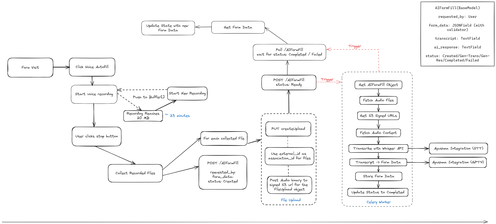

---
layout:
  title:
    visible: true
  description:
    visible: false
  tableOfContents:
    visible: true
  outline:
    visible: true
  pagination:
    visible: true
---

# Feature Flow

This section details the operational flow of the Care Scribe feature, from the initiation of voice recording to the final form submission.

## High-Level Feature Operation

Care Scribe enhances user interaction with form fields through voice commands. The feature operates by:

1. Initiating voice recording when a user visits a form and activates the 'Voice Autofill' option.
2. Stopping the recording on user command and processing the audio data.
3. Transcribing the voice recording into text and mapping the transcription to the relevant form fields.
4. Updating the form with the transcribed data and submitting it to the backend.

The process is designed to be intuitive and efficient, minimizing the need for manual text entry and reducing the potential for data entry errors.

## Detailed Flow

The flowchart outlines the step-by-step process of the Care Scribe feature. Below is an explanation of each step:

<figure><figcaption></figcaption></figure>

1. **Form Visit**: The user navigates to a form within the application.
2. **Click Voice Autofill**: The user initiates the voice autofill feature.
3. **Start Voice Recording**: Care Scribe begins recording the user's voice inputs.
4. **User Clicks Stop Button**: The user ends the voice recording session.
5. **Recording Reaches 20 MB or \~23 Minutes**: The system automatically starts a new recording session to prevent data loss and ensure manageable file sizes.
6. **Start New Recording**: If the initial recording session is stopped manually or reaches the file size/time limit, a new recording session begins.
7. **Push to Buffer\[]**: Audio data is temporarily stored in a buffer as it is being processed.
8. **Collect Recorded Files**: The audio files are collected for transcription.
9. **POST /scribe**: The system creates a new Scribe object with `requested_by`, `form_data`, and sets the status to 'Created'.
10. **PUT CreateUpload**: Prepares the collected files for upload.
11. **For Each Collected File**: Each audio file undergoes the following process:
    * **Use external\_id as association\_id for Files**: Links the audio files to the corresponding form instance.
    * **Post Audio binary to signed S3 URL for the FileUpload object**: Uploads the audio to a secure S3 bucket.
    * **File Upload**: Completes the file upload process.
12. **Poll /AIFormFill**: The system polls for the status of the AIFormFill object to be 'Completed' or 'Failed'.
13. **Get Form Data**: Retrieves the latest form data.
14. **Update State with New Form Data**: Updates the application state with the new data from the form.
15. **Get AIFormFill Object**: Accesses the AIFormFill object for processing.
16. **Fetch Audio Files**: Retrieves the audio files associated with the AIFormFill object.
17. **Get S3 Signed URLs**: Obtains secure URLs for the audio files stored in S3.
18. **Fetch Audio Content**: Downloads the audio content from S3.
19. **Transcribe with Whisper API**: Uses the Whisper API to transcribe audio content to text.
20. **Transcript -> Form Data**: Maps the transcribed text to the appropriate form fields.
21. **Store Form Data**: Saves the mapped form data.
22. **Update Status to Completed**: Sets the AIFormFill object's status to 'Completed' after a successful operation.
23. **Celery Worker**: An asynchronous Celery worker performs tasks such as polling the status and updating the form data.
24. **Ayushma Integration (STT and GPT4)**: Integrates with Ayushma for additional Speech-to-Text and language processing capabilities, if necessary.

Each of these steps represents a critical point in the operational flow of the Care Scribe feature, ensuring a seamless and efficient form-filling experience for the user.
