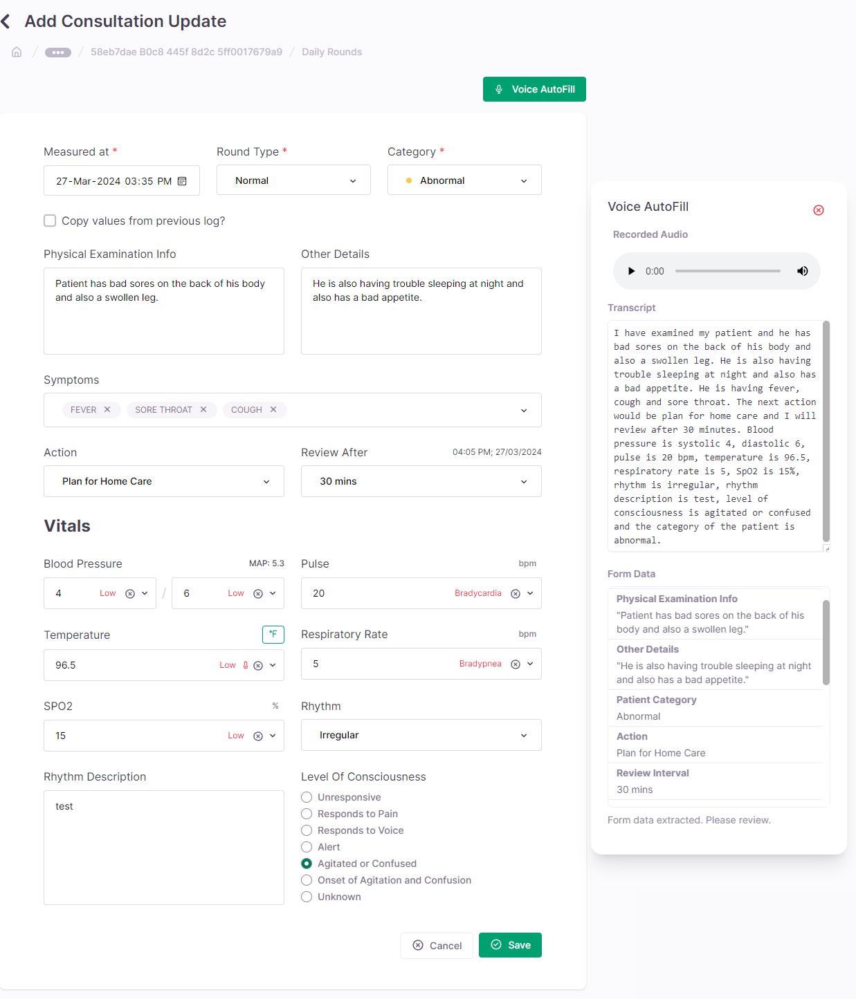

---
layout:
  title:
    visible: true
  description:
    visible: false
  tableOfContents:
    visible: true
  outline:
    visible: true
  pagination:
    visible: true
---

# Frontend Integration

Integrating the Care Scribe feature into the frontend involves updating the React components, state management, event handling, and ensuring the UI/UX and accessibility features are considered.

## Frontend Architecture Overview

<figure><figcaption></figcaption></figure>

The frontend architecture is built on React, utilizing functional components and hooks for state management. The integration of Care Scribe adds new components related to voice recording and form handling, which interact with the existing Redux store and backend API.

## Components and State Management

New components and hooks have been introduced to manage the state of voice recording and form data:

* `Scribe.tsx`: The primary component that handles voice recording, audio data management, and interaction with the backend to post form data.
* `formDetails.ts`: Contains the metadata and schema of form fields that can be auto-filled using the Scribe feature.
* `useSegmentedRecorder.ts`: A custom hook that manages voice recording, including starting, stopping, and segmenting the audio as it's recorded.

The state of the Scribe component is managed using local state hooks like `useState` and external state management using Redux for asynchronous actions and API interactions.

## Event Handlers

Event handlers within the Scribe component control the flow of user interactions:

* Voice recording is initiated and controlled through button clicks, triggering corresponding methods in the `useSegmentedRecorder` hook.
* Form updates are handled via callbacks when the transcription process is completed and the data is ready to be filled in the form.

## UI/UX Considerations

UI updates include:

* Adding a microphone icon to indicate voice recording capability.
* Visual feedback during recording, processing, and transcription phases.
* Modals and progress indicators to enhance user feedback during the operation of the Scribe feature.

## Accessibility Features

The Scribe component is designed with accessibility in mind:

* Keyboard navigable controls for starting and stopping recordings.
* ARIA labels and roles to ensure screen readers correctly interpret the purpose of the Scribe components and provide appropriate feedback to users with visual impairments.

### Code Snippets

The following snippets from the patch files demonstrate key aspects of the Scribe feature integration:

```jsx
// src/Components/Scribe/Scribe.tsx
// Example of the Scribe component initialization
<Scribe
  fields={DAILY_ROUND_FORM_SCRIBE_DATA}
  onFormUpdate={(fields) => {
    // Update form state with new fields
  }}
/>

// src/Components/Scribe/formDetails.ts
// Metadata for daily round form fields utilized by Scribe
export const DAILY_ROUND_FORM_SCRIBE_DATA: Field[] = [
  {
    friendlyName: "Temperature",
    id: "temperature",
    type: "number",
    example: "98.6",
    // Other field attributes...
  },
  // Additional fields...
];
```

With the frontend integration complete, the application provides a seamless and accessible form-filling experience, leveraging voice-to-text technology to enhance user interaction with the Care platform.
